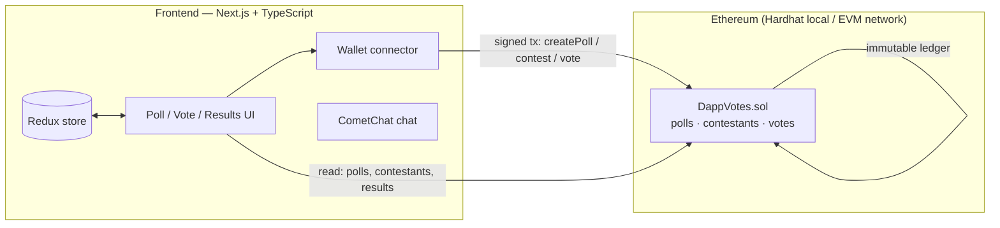

# Blockchain E-Voting System

> A full-stack decentralized voting dApp. Polls, contestants, and votes are stored on an **Ethereum smart contract**, so results are **immutable and publicly verifiable**. Voting is done from a connected web3 wallet through a Next.js interface, with an in-app chat for participants.

<p align="left">
  
  
  
  
  
</p>

---

## Overview

Traditional and centralized electronic voting systems ask you to *trust the operator* — trust that records weren't altered or deleted after the fact. This project moves the ballot box onto a **public blockchain**: each poll, contestant, and vote is a transaction against the `DappVotes` smart contract, so the tally is verifiable by anyone and modifiable by no one.

The frontend is a **Next.js + TypeScript** app with Redux state management and a Tailwind UI; it talks to the contract with **ethers.js** and includes a **CometChat**-powered chat so participants can discuss a poll.

## The problem

Centralized voting systems are vulnerable to:
- **Tampering** — records can be altered or deleted by whoever controls the database.
- **Opacity** — voters can't independently verify their vote was counted.
- **Double voting** — weak enforcement lets one account vote multiple times.

## The solution

Put the voting logic in a smart contract and let the chain enforce the rules:
- **Immutable records** — once a vote is mined it cannot be changed or removed.
- **On-chain enforcement** — poll lifecycle and one-vote-per-account rules live in Solidity, not in a mutable backend.
- **Public verifiability** — anyone can read the contract state and confirm the results.
- **Wallet-based participation** — voting is done from a connected web3 wallet (MetaMask), so ballots are tied to on-chain addresses rather than a trusted server.

## Features

- 🗳️ **Create, update, and delete polls** (with start/end windows)
- 🧑‍💼 **Register contestants** for a poll
- 👛 **Wallet-based voting** via MetaMask / web3 wallet (ethers.js)
- ⛓️ **On-chain vote recording** through the `DappVotes` Solidity contract
- 📊 **Live results** read directly from the chain
- 💬 **In-app chat** for a poll, powered by CometChat
- 💻 **Responsive UI** built with Next.js + Tailwind CSS + Redux

## Architecture



**Flow:** connect wallet → create a poll and register contestants → cast a vote (a signed transaction) → the contract records it immutably → results are read back directly from the chain.

## Tech stack

| Layer | Technology |
|---|---|
| Frontend | Next.js 13, React 18, TypeScript |
| State | Redux Toolkit |
| Styling | Tailwind CSS, PostCSS |
| Web3 | ethers.js v5 |
| Chat | CometChat (`@cometchat-pro/chat`) |
| Smart contract | Solidity 0.8.17 (`DappVotes.sol`), OpenZeppelin |
| Tooling | Hardhat, Waffle/Chai tests, ESLint, Prettier, Husky |

## Folder structure

```
E-voting-system-using-blockchain-technology/
├── contracts/
│   └── DappVotes.sol       # the voting smart contract
├── scripts/
│   └── deploy.js           # Hardhat deployment script
├── test/
│   └── DappVotes.test.js   # contract tests
├── pages/                  # Next.js routes (index, polls/[id], api)
├── components/             # React UI (CreatePoll, Contestants, ContestPoll, ...)
├── services/
│   ├── blockchain.ts       # contract interaction (ethers)
│   └── chat.ts             # CometChat integration
├── store/                  # Redux store, slices, state
├── styles/                 # Tailwind / global CSS
├── artifacts/              # compiled contract ABI + address (generated)
├── hardhat.config.js
└── package.json
```

## Installation

**Prerequisites:** Node.js 18+, Yarn, and a web3 wallet (MetaMask).

```bash
# 1. Clone
git clone https://github.com/DhanushRaj7/E-voting-system-using-blockchain-technology.git
cd E-voting-system-using-blockchain-technology

# 2. Install dependencies
yarn install

# 3. Configure environment
cp .env.example .env        # Windows: copy .env.example .env
# fill in the values (see .env.example)

# 4. Start a local blockchain (terminal 1)
npx hardhat node

# 5. Deploy the contract to the local node (terminal 2)
npx hardhat run scripts/deploy.js --network localhost

# 6. Run the frontend (terminal 2)
yarn dev
# open http://localhost:3000  (point MetaMask at the local Hardhat network)
```

## Usage

1. **Connect wallet** — link MetaMask (use the local Hardhat network for testing).
2. **Create a poll** — set the title, description, image, and voting window.
3. **Add contestants** — register the options voters can choose.
4. **Vote** — pick a contestant and confirm the transaction in your wallet.
5. **Results** — view the live, on-chain tally as votes come in.

## Testing

```bash
npx hardhat compile     # compile the contract
npx hardhat test        # run the contract test suite (test/DappVotes.test.js)
yarn lint               # lint the frontend
```

## Screenshots

_Screenshots from the project UI:_

| | |
|---|---|
| **Login screen** |  |
| **OTP verification screen** |  |
| **Home** |  |
| **Connect wallet to vote** |  |
| **Create poll** |  |
| **Register contestant** |  |
| **Cast vote** |  |
| **View results** |  |

## Future improvements

- [ ] Deploy to a public testnet (e.g. Sepolia) and link a **live demo**
- [ ] Document the deployed contract address + ABI in the README
- [ ] Add CI to compile and test the contract on every push
- [ ] Role-based access control for poll administration (OpenZeppelin `AccessControl`)
- [ ] Gas-optimization pass on the voting contract
- [ ] End-to-end tests (Playwright) for the full voting flow

## Lessons learned

- **The contract is the source of truth.** Keeping vote logic in Solidity and treating the frontend as a thin client makes correctness far easier to reason about.
- **Test the contracts first.** A bug in a deployed contract is permanent, so contract tests carry more weight than UI tests.
- **Separate concerns.** Splitting `services/blockchain.ts` (chain) from `services/chat.ts` (CometChat) and the Redux store kept the data flow clear.

## License

Released under the [MIT License](./LICENSE).

---

<sub>Final-year project by <a href="https://github.com/DhanushRaj7">Dhanush Raj</a> — full-stack decentralized application development with Solidity and Next.js.</sub>
